# bao

<p align="center">
  
</p>

<p align="center">
  <strong>你的手机就是遥控器，Claude 就是你的打工人。</strong>
</p>

<p align="center">
  <a href="#快速开始">快速开始</a> · <a href="#你能让它做什么">使用场景</a> · <a href="#核心能力">核心能力</a> · <a href="#定制">定制</a>
</p>

---

地铁上发条 WhatsApp，让 AI 帮你把今天的待办整理好。睡前发条 iMessage，让它明早 8 点把 AI 资讯简报发到你手机。周五下午它自动回顾本周 git 提交，生成周报丢给你。

你不用打开电脑。你不用盯着它。你甚至可以设完就忘——它自己会按时干活，干完把结果发回来。

bao 把 Claude 装进隔离的 Linux 容器里，通过你的手机接收指令。搜索、抓取、写文件、跑脚本、截图，全在沙箱里完成。每个群组独立隔离，互不干扰。

<p align="center">
  
</p>

## 快速开始

```bash
git clone https://github.com/Suge8/bao.git
cd bao
claude
```

输入 `/setup`，三分钟后开始用。

## 你能让它做什么

通勤路上，掏出手机：

```
@bao 帮我整理今天的待办，按优先级排好
```

睡前随手一条，明早自动收到：

```
@bao 每天早上 8 点查一下 Hacker News 前 10，挑 AI 相关的发给我
```

开会前需要竞品数据：

```
@bao 去这个网站把定价页截个图，再把竞品的价格整理成表格
```

设一次，每周自动跑：

```
@bao 每周五下午 5 点，回顾本周的 git 提交记录，生成周报发给我
```

<p align="center">
  
</p>

## 核心能力

|     | 能力              | 说明                                         |
| --- | ----------------- | -------------------------------------------- |
| 📱  | **手机遥控**      | WhatsApp / iMessage 下指令，结果直接发回手机 |
| 🔄  | **全自动任务**    | cron、固定间隔、一次性定时，设完不用管       |
| 🔒  | **容器隔离**      | 每次调用在独立 Linux 容器里跑，Bash 也安全   |
| 🧠  | **群组记忆**      | 每个群组独立文件系统和 `CLAUDE.md`，互不干扰 |
| 🌐  | **网络 + 浏览器** | 搜索、抓取、Chromium 截图填表，全在沙箱里    |
| 🎛️  | **主频道管控**    | 你的私人控制台，管所有群组、查所有任务       |

## 定制

不需要配置文件。跟 Claude 说人话就行：

```
把触发词改成 @bot
回答简短一些，别啰嗦
加个每天早上的天气提醒
```

或者运行 `/customize`。代码就这么几个文件，改起来很安全。

## 系统要求

- macOS 或 Linux
- Node.js 20+
- [Claude Code](https://claude.ai/download)
- [Apple Container](https://github.com/apple/container)（macOS）或 Docker

## 项目结构

```
src/
├── index.ts              # 主流程：消息循环、调用容器
├── channels/
│   ├── whatsapp.ts       # WhatsApp 连接
│   └── imessage.ts       # iMessage 频道
├── container-runner.ts   # 启动容器、挂载目录
├── db.ts                 # SQLite 操作
├── router.ts             # 消息格式化、路由
├── ipc.ts                # 容器间通信
├── task-scheduler.ts     # 定时任务
└── config.ts             # 配置常量

groups/
├── global/CLAUDE.md      # 全局记忆
└── {群组名}/CLAUDE.md    # 群组记忆
```

## 许可证

MIT
