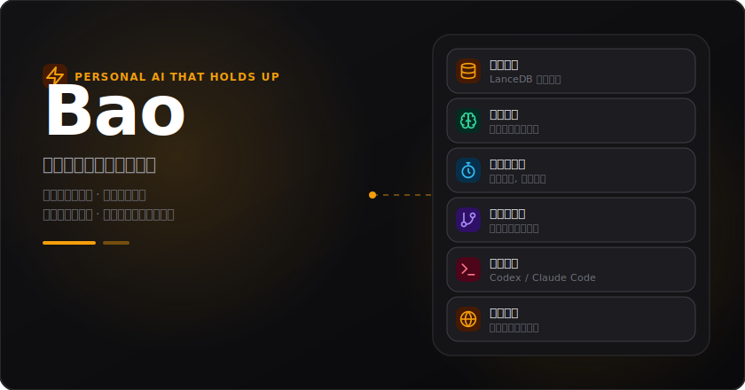
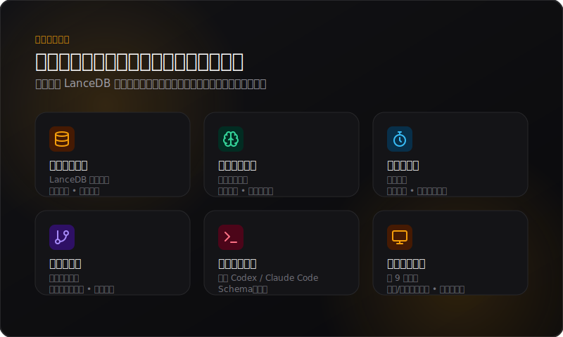
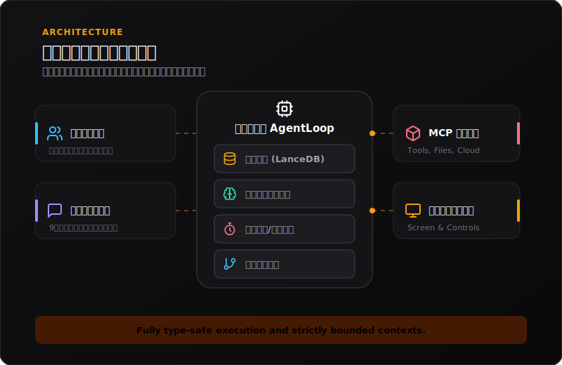
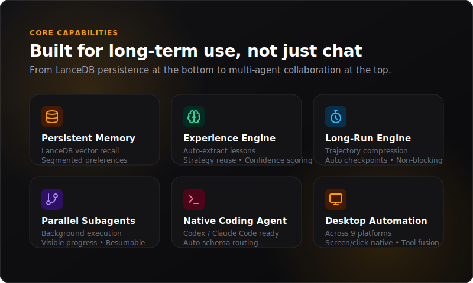
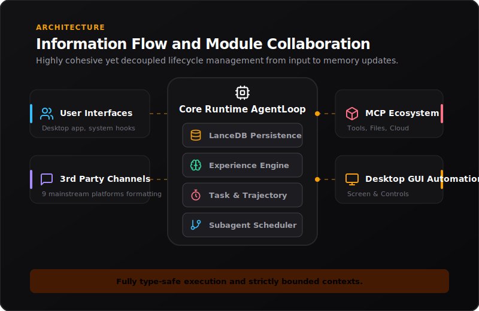

<div align="center">

<br>

<picture>
  <source media="(prefers-color-scheme: dark)" srcset="assets/hero-dark.svg" />
  <source media="(prefers-color-scheme: light)" srcset="assets/hero-light.svg" />
  
</picture>

<br>

**下载即用的桌面 AI 助手** · 真正的持久记忆 · 从经验中学习 · 长任务不阻塞 · 9 大平台 · MCP 生态

[🇨🇳 中文](#为什么选-bao) · [🇺🇸 English](#-english)

</div>

<br>

## 为什么选 Bao？

**Bao 是一个会记住你、会学习、会成长的 AI 助手。**

不是聊天机器人，不是 API 包装器，而是一个真正能长期陪伴你的智能系统。

从 [GitHub Releases](https://github.com/Suge8/Bao/releases) 下载桌面端，双击安装，3 分钟配置完成。无需命令行，无需配置文件，开箱即用。

### 🎯 三个核心优势

#### 1. 真正的持久记忆系统

大多数 AI 助手每次对话都从零开始。Bao 不一样。

基于 **LanceDB** 的记忆系统会跨会话保留你的偏好、项目背景和长期约定。向量检索 + 关键词检索双通路，智能注入相关上下文，不会把整段历史硬塞回 prompt。

**记忆分类管理**：偏好、个人信息、项目知识、通用事实，四类独立存储，过时内容主动清理，重要信息长期保留。

#### 2. 从经验中持续学习

Bao 有闭环经验引擎。一次任务里踩过的坑，下次不会再从零开始。

- 自动提取教训、策略和失败模式
- 相似任务自动召回相关经验
- 质量评分系统：高质量经验（≥5 分，使用 ≥3 次）永久保留
- 工具失败后会反思重试，而不是机械重复到超时

**它会随着使用持续变得更适合你。**

#### 3. 强大的长任务引擎

复杂任务不会卡住当前对话。Bao 支持子代理并行执行，你可以继续聊天，它在后台把耗时工作做完。

- **轨迹压缩**：每 5 步自动压缩执行历史，保持上下文清晰
- **充分性检查**：自动判断是否已收集足够信息，避免无效循环
- **进度透明**：实时查询阶段、工具数、迭代轮次和最近动作
- **灵活控制**：支持取消、续接和结构化任务跟踪

一个助手，不必被一件慢任务拖住全部交互。

<p align="center">
<picture>
  <source media="(prefers-color-scheme: dark)" srcset="assets/features-dark.svg" />
  <source media="(prefers-color-scheme: light)" srcset="assets/features-light.svg" />
  
</picture>
</p>

### 💎 为什么选择 Bao

**对普通用户**：下载桌面端，3 分钟配置完成，开箱即用。无需命令行，无需编辑配置文件。

**对开发者**：约 12,000 行核心 Python 代码，结构紧凑，易于扩展。原生接入编程代理（Codex、Claude Code、OpenCode），MCP 工具生态，技能系统兼容 ClawHub。

**对所有人**：桌面端、CLI、9 大聊天平台共用同一套 core，没有两套实现长期漂移。上下文管理、自动规划、长任务控制都是内建能力，不需要外围补丁

## 🔄 与 OpenClaw 的对比

OpenClaw 是一个优秀的开源 AI 助手项目，定位是 **local-first、Gateway 驱动**，拥有完整的控制面体系（macOS app、Web UI、CLI、移动节点）。

Bao 的核心取舍不同：**更短的上手路径 + 更强的记忆与学习能力**。

| 维度 | OpenClaw | Bao |
|:---|:---|:---|
| **上手体验** | CLI 向导 + 配置文件 + Gateway 启动 | **下载桌面端，3 分钟配置完成** |
| **部署依赖** | Node 22+ / pnpm / Gateway 工作流 | **桌面端零依赖**，开发侧需 Python/uv |
| **核心优势** | 完整 Gateway 控制面 + 多端协同 | **持久记忆 + 经验学习 + 长任务引擎** |
| **长任务处理** | Gateway 工具执行 | 轨迹压缩、充分性检查、子代理并行 |
| **记忆系统** | 基础会话历史 | LanceDB 向量检索 + 分类记忆 + 经验引擎 |
| **技能生态** | 官方 Skills + ClawHub | **兼容 ClawHub**，支持 `SKILL.md` 格式 |
| **适合人群** | 需要完整 Gateway 体系的用户 | **想快速上手 + 保留扩展性的用户** |

**一句话总结**：

- OpenClaw：更广的官方控制面，适合需要完整 Gateway 架构的场景
- Bao：更快的落地路径，更强的记忆与学习能力，适合长期陪伴型使用

<!-- Blank line required for GitHub to parse HTML after Markdown table -->

<p align="center">
<picture>
  <source media="(prefers-color-scheme: dark)" srcset="assets/architecture-dark.svg" />
  <source media="(prefers-color-scheme: light)" srcset="assets/architecture-light.svg" />
  
</picture>
</p>

## 🚀 快速开始

### 方式 1：桌面端（推荐）

前往 [GitHub Releases](https://github.com/Suge8/Bao/releases) 下载安装包：

- **macOS**：`Bao-x.y.z-macos-arm64.dmg`（Apple Silicon）或 `Bao-x.y.z-macos-x86_64.dmg`（Intel）
- **Windows**：`Bao-x.y.z-windows-x64-setup.exe`

安装后打开 Bao Desktop，按界面引导完成配置（3 分钟）：

1. 选择界面语言
2. 配置 AI 服务（支持 OpenAI、Anthropic、Gemini、DeepSeek 等）
3. 选择默认模型
4. 启动网关，开始使用

### 方式 2：命令行（终端用户）

```bash
pip install -U bao-ai
bao
```

### 方式 3：源码（开发者）

```bash
git clone https://github.com/Suge8/Bao.git
cd Bao
uv sync
uv run bao
```

首次运行自动生成 `~/.bao/config.jsonc`。最小配置：

```json
{
  "providers": {
    "openaiCompatible": {
      "apiKey": "sk-or-v1-xxx"
    }
  }
}
```

**可选**：配置效用模型节省成本（用于后台任务）

```json
{
  "agents": {
    "defaults": {
      "model": "anthropic/claude-sonnet-4-20250514",
      "utilityModel": "openrouter/google/gemini-flash-1.5"
    }
  }
}
```

## 💬 9 大聊天平台

一份配置，同时接入 9 个平台。每个平台自动适配最佳渲染格式。

| 平台 | 配置 | 渲染 |
|:---|:---|:---|
| **Telegram** | @BotFather 获取 Token | 富文本 Markdown |
| **Discord** | Bot Token + Intent | 富文本 Markdown |
| **WhatsApp** | 扫码连接 | 纯文本 |
| **飞书** | App ID + Secret | 原生标记 |
| **Slack** | Bot Token + App Token | 原生标记 |
| **Email** | IMAP/SMTP | 纯文本 |
| **QQ** | App ID + Secret | 纯文本 |
| **钉钉** | App Key + Secret | 原生标记 |
| **iMessage** | macOS 零配置 | 纯文本 |

**同一个 AI，9 种最佳阅读体验。**

## 🤖 LLM Provider

极简 4 类配置，覆盖所有主流模型。

| 类型 | 支持 | 示例 |
|:---|:---|:---|
| **OpenAI 兼容** | OpenAI、OpenRouter、DeepSeek、Groq、Ollama、vLLM 等 | `openai/gpt-4o` |
| **Anthropic** | Claude 全系列 | `anthropic/claude-sonnet-4-20250514` |
| **Gemini** | Gemini 全系列 | `gemini/gemini-2.0-flash-exp` |
| **Codex OAuth** | 通过 ChatGPT 订阅认证，无需 API Key | `openai-codex/gpt-5.1-codex` |

**智能特性**：
- Provider 名称可自定义（如 `my-proxy/claude-sonnet-4-6`）
- OpenAI 兼容端点自动探测 Responses / Chat Completions
- `apiBase` 自动补全版本段，避免重复拼接
- 推理强度支持：`off` / `low` / `medium` / `high`

## 🔌 MCP 支持

Model Context Protocol — 接入任何工具生态。配置兼容 **Claude Desktop 和 Cursor**。

```json
{
  "tools": {
    "toolExposure": {
      "mode": "auto"  // 智能路由，按需曝光工具
    },
    "mcpMaxTools": 50,
    "mcpSlimSchema": true,
    "mcpServers": {
      "filesystem": {
        "command": "npx",
        "args": ["-y", "@modelcontextprotocol/server-filesystem", "/path"]
      }
    }
  }
}
```

**智能工具路由**：`toolExposure.mode: auto` 会自动打分，只曝光最相关的工具，避免 token 浪费。

## 💬 聊天命令

全平台通用命令：

| 命令 | 说明 |
|:---|:---|
| `/new` | 新建对话（旧对话自动保留） |
| `/stop` | 停止当前任务 |
| `/session` | 列出所有对话，按编号切换 |
| `/delete` | 删除当前对话 |
| `/model` | 切换模型 |
| `/memory` | 管理记忆（查看、编辑、删除） |
| `/help` | 显示可用命令 |

## 🐳 Docker 部署

```bash
# 1. 准备配置
vim ~/.bao/config.jsonc

# 2. 复制环境变量模板
cp .env.docker.example .env.docker

# 3. 启动网关
docker compose --env-file .env.docker up -d bao-gateway

# 4. 查看日志
docker compose logs -f --tail=100 bao-gateway
```

## 🖥️ Desktop App

Bao Desktop 是主入口。大多数用户直接下载 Release；开发者本地运行：

```bash
uv sync --extra desktop
uv run python app/main.py
```

首次启动自动创建配置与 workspace。详见 [`app/README.md`](app/README.md) 和 [`docs/desktop-packaging.md`](docs/desktop-packaging.md)。

## 🔒 安全

内置多层安全机制：工作区沙箱、渠道白名单、危险命令拦截、SecretStr 凭据保护。

完整安全配置见 [`SECURITY.md`](SECURITY.md)。

## 📁 项目结构

```
bao/
├── agent/          # 核心 Agent 逻辑
│   ├── loop.py     # Agent 循环（重试 + 纠错 + 经验）
│   ├── context.py  # 提示词组装 + 经验注入
│   ├── memory.py   # LanceDB 持久记忆
│   ├── subagent.py # 后台任务执行
│   └── tools/      # 内置工具
├── skills/         # 可扩展技能系统
├── channels/       # 9 大平台集成
├── providers/      # 4 种 LLM Provider
├── session/        # 多会话管理
└── cli/            # 命令行界面
```

## 📝 Changelog

最新发布版本与变更记录详见 [`CHANGELOG.md`](CHANGELOG.md)。

<br>

<details>
<summary><h2>🇺🇸 English</h2></summary>

<div align="center">


<br>

**Download and use instantly** · True persistent memory · Learns from experience · Long tasks don't block · 9 platforms · MCP ecosystem

</div>

<br>

### Why Bao?

**Bao is an AI assistant that remembers, learns, and grows with you.**

Not a chatbot, not an API wrapper, but a truly long-term intelligent companion.

Download the desktop app from [GitHub Releases](https://github.com/Suge8/Bao/releases), double-click to install, 3 minutes to configure. No command line, no config files, ready to use out of the box.

### 🎯 Three Core Advantages

#### 1. True Persistent Memory System

Most AI assistants start from scratch every conversation. Bao is different.

The **LanceDB**-based memory system preserves your preferences, project context, and long-term agreements across sessions. Vector retrieval + keyword retrieval dual pathways, intelligently injecting relevant context without stuffing entire history back into prompts.

**Categorized memory management**: Preferences, personal info, project knowledge, general facts — four independent categories, stale content actively cleaned, important information retained long-term.

#### 2. Continuous Learning from Experience

Bao has a closed-loop experience engine. Mistakes made once won't be repeated from scratch next time.

- Automatically extracts lessons, strategies, and failure patterns
- Recalls relevant experience for similar tasks
- Quality scoring system: high-quality experiences (≥5 score, ≥3 uses) permanently retained
- Reflects and retries after tool failures, not mechanical repetition until timeout

**It gets better the more you use it.**

#### 3. Powerful Long-Task Engine

Complex tasks don't block the current conversation. Bao supports parallel subagent execution — you can keep chatting while it completes time-consuming work in the background.

- **Trajectory compression**: Automatically compresses execution history every 5 steps, keeping context clear
- **Sufficiency checks**: Automatically determines if enough information has been gathered, avoiding ineffective loops
- **Progress transparency**: Real-time query of phase, tool count, iteration rounds, and recent actions
- **Flexible control**: Supports cancellation, resumption, and structured task tracking

One assistant shouldn't be held hostage by one slow task.

<p align="center">

</p>

### 💎 Why Choose Bao

**For regular users**: Download the desktop app, 3 minutes to configure, ready to use. No command line, no editing config files.

**For developers**: ~12,000 lines of core Python code, compact structure, easy to extend. Native integration with coding agents (Codex, Claude Code, OpenCode), MCP tool ecosystem, skill system compatible with ClawHub.

**For everyone**: Desktop, CLI, and 9 chat platforms share the same core — no two implementations drifting apart. Context management, auto-planning, and long-task control are all built-in capabilities, no external patches needed.

### 🔄 Comparison With OpenClaw

OpenClaw is an excellent open-source AI assistant project, positioned as **local-first, Gateway-driven**, with a complete control surface system (macOS app, Web UI, CLI, mobile nodes).

Bao's core tradeoff is different: **shorter onboarding path + stronger memory and learning capabilities**.

| Dimension | OpenClaw | Bao |
|:---|:---|:---|
| **Onboarding** | CLI wizard + config files + Gateway startup | **Download desktop app, 3 minutes to configure** |
| **Deployment** | Node 22+ / pnpm / Gateway workflow | **Desktop app zero dependencies**, dev side needs Python/uv |
| **Core strength** | Complete Gateway control surface + multi-device coordination | **Persistent memory + experience learning + long-task engine** |
| **Long tasks** | Gateway tool execution | Trajectory compression, sufficiency checks, parallel subagents |
| **Memory system** | Basic conversation history | LanceDB vector retrieval + categorized memory + experience engine |
| **Skill ecosystem** | Official Skills + ClawHub | **Compatible with ClawHub**, supports `SKILL.md` format |
| **Best for** | Users who need complete Gateway architecture | **Users who want quick start + retain extensibility** |

**In short**:

- OpenClaw: Broader official control surface, suitable for scenarios requiring complete Gateway architecture
- Bao: Faster deployment path, stronger memory and learning capabilities, suitable for long-term companion use

<p align="center">

</p>

### 🚀 Quick Start

#### Method 1: Desktop App (Recommended)

Download from [GitHub Releases](https://github.com/Suge8/Bao/releases):

- **macOS**: `Bao-x.y.z-macos-arm64.dmg` (Apple Silicon) or `Bao-x.y.z-macos-x86_64.dmg` (Intel)
- **Windows**: `Bao-x.y.z-windows-x64-setup.exe`

After installation, open Bao Desktop and follow the guide (3 minutes):

1. Choose UI language
2. Configure AI service (supports OpenAI, Anthropic, Gemini, DeepSeek, etc.)
3. Select default model
4. Start gateway and begin using

#### Method 2: Command Line (Terminal Users)

```bash
pip install -U bao-ai
bao
```

#### Method 3: Source Code (Developers)

```bash
git clone https://github.com/Suge8/Bao.git
cd Bao
uv sync
uv run bao
```

First run auto-generates `~/.bao/config.jsonc`. Minimal config:

```json
{
  "providers": {
    "openaiCompatible": {
      "apiKey": "sk-or-v1-xxx"
    }
  }
}
```

**Optional**: Configure utility model to save costs (for background tasks)

```json
{
  "agents": {
    "defaults": {
      "model": "anthropic/claude-sonnet-4-20250514",
      "utilityModel": "openrouter/google/gemini-flash-1.5"
    }
  }
}
```

### 📝 Changelog

See [`CHANGELOG.md`](CHANGELOG.md) for the latest release and change history.

### 💬 9 Chat Platforms

One config, connect to 9 platforms simultaneously. Each platform auto-adapts to optimal rendering format.

| Platform | Setup | Rendering |
|:---|:---|:---|
| **Telegram** | Token from @BotFather | Rich Markdown |
| **Discord** | Bot Token + Intent | Rich Markdown |
| **WhatsApp** | Scan QR code | Plain text |
| **Feishu** | App ID + Secret | Native markup |
| **Slack** | Bot Token + App Token | Native markup |
| **Email** | IMAP/SMTP | Plain text |
| **QQ** | App ID + Secret | Plain text |
| **DingTalk** | App Key + Secret | Native markup |
| **iMessage** | macOS zero config | Plain text |

**One AI, nine tailored reading experiences.**

### 🤖 LLM Provider

Simple 4-type config, covers all mainstream models.

| Type | Support | Example |
|:---|:---|:---|
| **OpenAI Compatible** | OpenAI, OpenRouter, DeepSeek, Groq, Ollama, vLLM, etc. | `openai/gpt-4o` |
| **Anthropic** | Full Claude lineup | `anthropic/claude-sonnet-4-20250514` |
| **Gemini** | Full Gemini lineup | `gemini/gemini-2.0-flash-exp` |
| **Codex OAuth** | Auth via ChatGPT subscription, no API Key needed | `openai-codex/gpt-5.1-codex` |

**Smart features**:
- Customizable provider names (e.g., `my-proxy/claude-sonnet-4-6`)
- OpenAI-compatible endpoints auto-detect Responses / Chat Completions
- `apiBase` auto-completes version segments, avoids duplicate concatenation
- Reasoning effort support: `off` / `low` / `medium` / `high`

### 🔌 MCP Support

Model Context Protocol — plug into any tool ecosystem. Config format **compatible with Claude Desktop and Cursor**.

```json
{
  "tools": {
    "toolExposure": {
      "mode": "auto"  // Smart routing, expose tools on demand
    },
    "mcpMaxTools": 50,
    "mcpSlimSchema": true,
    "mcpServers": {
      "filesystem": {
        "command": "npx",
        "args": ["-y", "@modelcontextprotocol/server-filesystem", "/path"]
      }
    }
  }
}
```

**Smart tool routing**: `toolExposure.mode: auto` automatically scores and exposes only the most relevant tools, avoiding token waste.

### 💬 Chat Commands

Universal commands across all platforms:

| Command | Description |
|:---|:---|
| `/new` | Start a new conversation (old one preserved) |
| `/stop` | Stop current task |
| `/session` | List all conversations, switch by number |
| `/delete` | Delete current conversation |
| `/model` | Switch model |
| `/memory` | Manage memories (view, edit, delete) |
| `/help` | Show available commands |

### 🐳 Docker Deployment

```bash
# 1. Prepare config
vim ~/.bao/config.jsonc

# 2. Copy environment template
cp .env.docker.example .env.docker

# 3. Start gateway
docker compose --env-file .env.docker up -d bao-gateway

# 4. View logs
docker compose logs -f --tail=100 bao-gateway
```

### 🖥️ Desktop App

Bao Desktop is the main entry point. Most users download Release directly; developers run locally:

```bash
uv sync --extra desktop
uv run python app/main.py
```

First launch auto-creates config and workspace. See [`app/README.md`](app/README.md) and [`docs/desktop-packaging.md`](docs/desktop-packaging.md).

### 🔒 Security

Built-in multi-layer security: workspace sandboxing, channel allowlists, dangerous command interception, SecretStr credential protection.

Full security config: [`SECURITY.md`](SECURITY.md).

### 📁 Project Structure

```
bao/
├── agent/          # Core agent logic
│   ├── loop.py     # Agent loop (retry + correction + experience)
│   ├── context.py  # Prompt assembly + experience injection
│   ├── memory.py   # LanceDB persistent memory
│   ├── subagent.py # Background task execution
│   └── tools/      # Built-in tools
├── skills/         # Extensible skill system
├── channels/       # 9 platform integrations
├── providers/      # 4 LLM provider types
├── session/        # Multi-session management
└── cli/            # Command line interface
```

</details>

<br>

<div align="center">

<sub>Bao — An AI assistant that remembers.</sub>

</div>
