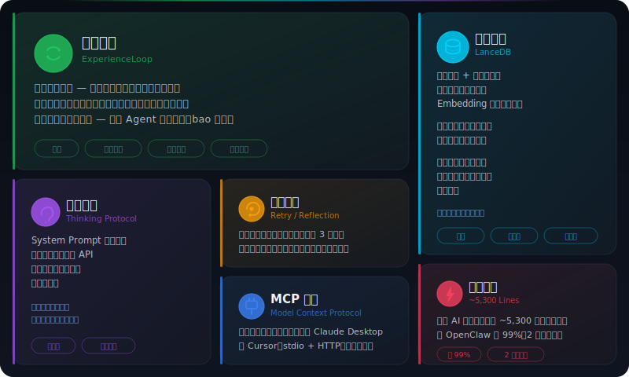

<div align="center">

<br>

<picture>
  <source media="(prefers-color-scheme: dark)" srcset="docs/hero.svg" />
  <source media="(prefers-color-scheme: light)" srcset="docs/hero.svg" />
  
</picture>

<br>

**~5,300 行核心代码** · 记忆永不消失 · 经验持续积累 · 智能不断进化

[🇨🇳 中文](#为什么选-bao) · [🇺🇸 English](#-english)

</div>

<br>

## 为什么选 bao？

大多数 AI 助手都有失忆症。每次对话从零开始，反复犯同样的错，记不住你的偏好，永远学不会。

bao 不一样。它**记得住**、**学得会**、**能进化**。

<p align="center"></p>

### 记忆不会消失

基于 **LanceDB** 的持久化记忆 — 向量搜索 + 关键词降级，双检索架构。有没有 Embedding 模型都能用。

你的偏好、你的项目、你的习惯，bao 全部记住。旧上下文自动整合，重要信息跨会话、跨重启永久留存，过时内容主动清理。

### 经验持续积累

内置**闭环经验引擎**：

- 每次任务完成 → 自动提取教训、策略和失败模式
- 遇到类似问题 → 检索相关经验，注入到提示词中
- **置信度校准** — Laplace 平滑追踪成功率，避免冷启动偏差，动态调整质量分
- **冲突检测** — 发现矛盾的教训时自动标记
- **负面学习** — 过去的失败变成未来的警告
- **主动遗忘** — 按质量分级衰减（高质量保留更久），高价值经验免疫清理

别的 Agent 重复犯错。**bao 从错误中进化。**

### 思考更有深度

- **Thinking Protocol** — 深度推理协议内置于系统提示词。零额外 API 调用，回答质量显著提升
- **Retry with Reflection** — 自动检测工具报错并重试。连续 3 次失败后，升级为完整的策略反思
- **Dynamic Tool Hints** — 根据实际可用性动态启停工具提示。杜绝幻觉工具调用

### 极致轻量

**~5,300 行核心代码。** 运行 `bash core_agent_lines.sh` 自行验证。

启动快、占资源少、源码可读。一个完整的 AI 助手框架，体积只有同类项目的 1%。
### 上下文不会爆炸
内置分层上下文管理，长任务不再耗尽 context window：
- **Layer 1**：tool 输出超过阈值自动外置到本地文件，messages 中只保留预览+指针
- **Layer 2**：context 过大时自动压实，保留最近 N 对 assistant/tool 消息，严格维护成对完整性
配置 `contextManagement: "auto"` 即可启用，默认 `observe` 模式零额外开销。

## 横向对比

| | OpenClaw | **bao** |
|---|---|---|
| 语言 | TypeScript | **Python** |
| 核心代码 | 430,000+ 行 | **~5,300 行** |
| 记忆 | 仅会话内 | **LanceDB（向量 + 关键词）** |
| 经验学习 | — | **ExperienceLoop** |
| 自我反思 | — | **Thinking Protocol + Retry** |
| 开放问题 | 8,400+ | **稳定且专注** |
| 上手时间 | 复杂引导 | **2 分钟** |

<p align="center"></p>

## 🚀 快速开始

```bash
pip install bao-ai
bao
```

首次运行自动生成配置文件。在 `~/.bao/config.jsonc` 中设置你的 API Key：

```json
{
  "providers": {
    "openaiCompatible": {
      "apiKey": "sk-or-v1-xxx"
    }
  }
}
```

再次运行：

```bash
bao
```

**就这样。2 分钟，一个完整的 AI 助手。**

可选：运行桌面客户端（PySide6）：

```bash
uv sync --extra desktop
uv run python app/main.py
```

桌面端是可选入口，不影响命令行 `bao` 的使用。

可选：配置一个**效用模型**用于后台任务（经验提取、记忆整合、会话标题生成），节省开销：

```json
{
  "agents": {
    "defaults": {
      "model": "anthropic/claude-sonnet-4-20250514",
      "utilityModel": "openrouter/google/gemini-flash-1.5"
    }
  }
}
```

## 💬 9 大聊天平台

一份配置，一条命令：`bao`

| 平台 | 配置方式 |
|------|---------|
| **Telegram** | @BotFather 获取 Token |
| **Discord** | Bot Token + Message Content Intent |
| **WhatsApp** | 扫码连接 |
| **飞书** | App ID + App Secret |
| **Slack** | Bot Token + App-Level Token |
| **Email** | IMAP/SMTP 凭据 |
| **QQ** | App ID + App Secret |
| **钉钉** | App Key + App Secret |
| **iMessage** | 仅 macOS，零配置 |

## 🤖 LLM Provider

极简 3 类覆盖 99% 需求。

| 类型 | 支持的模型 | 示例 |
|------|-----------|------|
| **OpenAI 兼容** | OpenAI、OpenRouter、DeepSeek、Groq、SiliconFlow、火山引擎、DashScope、Moonshot、智谱、Ollama、LM Studio、vLLM 等 | `openai/gpt-4o`、`deepseek/deepseek-chat` |
| **Anthropic** | Claude 全系列 | `anthropic/claude-sonnet-4-20250514` |
| **Gemini** | Gemini 全系列 | `gemini/gemini-2.0-flash-exp` |

Provider 名称可自定义（如 `my-proxy/claude-sonnet-4-6`），前缀自动剥离。所有 Provider 类型均支持第三方代理，SDK 兼容性自动处理。OpenAI 兼容端点额外支持 API 模式自动探测（Responses / Chat Completions）。

## 🔌 MCP 支持

Model Context Protocol — 接入任何工具生态。配置兼容 **Claude Desktop 和 Cursor**：

```json
{
  "tools": {
    "mcpServers": {
      "filesystem": {
        "command": "npx",
        "args": ["-y", "@modelcontextprotocol/server-filesystem", "/path"]
      }
    }
  }
}
```

## 🐳 Docker

```bash
vim ~/.bao/config.jsonc
docker compose up -d bao-gateway
```

## 💬 聊天命令

全平台通用：

| 命令 | 说明 |
|------|------|
| `/new` | 新建对话（旧对话自动保留） |
| `/session` | 列出所有对话，按编号选择（含自动标题） |
| `/delete` | 删除当前对话 |
| `/model` | 切换模型 |
| `/help` | 显示可用命令 |

首轮对话后，bao 自动生成简短的会话标题，跟随用户语言。

## 🖥️ CLI

| 命令 | 说明 |
|------|------|
| `bao` | 启动所有平台通道（首次运行自动初始化） |

## 📁 项目结构

```
bao/
├── agent/          # 核心 Agent 逻辑
│   ├── loop.py     # Agent 循环（思考 + 重试 + 经验）
│   ├── context.py  # 提示词组装 + 经验注入
│   ├── memory.py   # LanceDB 持久记忆
│   ├── subagent.py # 后台任务执行
│   └── tools/      # 内置工具（Shell、文件、Web、MCP）
├── skills/         # 可扩展技能系统
├── channels/       # 9 大平台集成
├── providers/      # 3 种 LLM Provider
├── session/        # 多会话管理（LanceDB 持久化）
├── bus/            # 异步消息路由
├── cron/           # 定时任务
└── cli/            # 命令行界面
```

<br>

<details>
<summary><h2>🇺🇸 English</h2></summary>

<div align="center">

<picture>
  <source media="(prefers-color-scheme: dark)" srcset="docs/hero-en.svg" />
  <source media="(prefers-color-scheme: light)" srcset="docs/hero-en.svg" />
  
</picture>

<br>

**~5,300 lines of core code** · Memory that persists · Experience that compounds · Intelligence that evolves

</div>

<br>

### Why bao?

Most AI assistants have amnesia. Every conversation starts from zero. They repeat the same mistakes, forget your preferences, and never improve.

bao is different. It **remembers**, **reflects**, and **evolves**.

<p align="center"></p>

#### Memory That Stays

Persistent memory powered by **LanceDB** — vector search with keyword fallback. Dual retrieval that works with or without an embedding model.

Your preferences, your projects, your patterns — bao remembers all of it. Old context consolidates automatically. Important details survive across sessions, across restarts, indefinitely. Stale content is actively cleaned up.

#### Experience That Compounds

bao ships with a **closed-loop experience engine**:

- After every task → auto-extracts lessons, strategies, and failure patterns
- Before similar tasks → retrieves relevant experience and injects it into the prompt
- **Confidence calibration** — Laplace-smoothed success tracking, no cold-start bias, dynamic quality adjustment
- **Conflict detection** — flags contradictory lessons
- **Negative learning** — past failures become warnings
- **Active forgetting** — quality-based retention decay (high-quality lasts longer), high-value experiences immune from cleanup

Other agents repeat mistakes. **bao learns from them.**

#### Thinking That Goes Deep

- **Thinking Protocol** — deep reasoning baked into the system prompt. Zero extra API calls, measurably better answers
- **Retry with Reflection** — auto-detects tool errors. After 3 consecutive failures, escalates to a full strategy pivot
- **Dynamic Tool Hints** — enables and disables tool suggestions based on actual availability. No hallucinated tool calls

#### Ultra Lightweight

**~5,300 lines of core code.** Run `bash core_agent_lines.sh` to verify.

Fast startup. Low resource use. Readable source. A complete AI assistant framework at 1% the size of comparable projects.
### Context That Doesn't Explode
Built-in layered context management keeps long tasks from exhausting the context window:
- **Layer 1**: Large tool outputs are offloaded to local files; messages retain only a preview + pointer
- **Layer 2**: When context grows too large, older assistant/tool pairs are archived, preserving strict pairing integrity
Set `contextManagement: "auto"` to enable. Default `observe` mode has zero overhead.

### How It Compares

| | OpenClaw | **bao** |
|---|---|---|
| Language | TypeScript | **Python** |
| Core code | 430,000+ lines | **~5,300 lines** |
| Memory | Session-only | **LanceDB (vector + keyword)** |
| Experience learning | — | **ExperienceLoop** |
| Self-reflection | — | **Thinking Protocol + Retry** |
| Open issues | 8,400+ | **Stable & focused** |
| Setup time | Complex wizard | **2 minutes** |

<p align="center"></p>

### 🚀 Quick Start

```bash
pip install bao-ai
bao
```

First run auto-generates a config file. Set your API key in `~/.bao/config.jsonc`:

```json
{
  "providers": {
    "openaiCompatible": {
      "apiKey": "sk-or-v1-xxx"
    }
  }
}
```

Run again:

```bash
bao
```

**That's it. 2 minutes to a working AI assistant.**

Optional: run the desktop client (PySide6):

```bash
uv sync --extra desktop
uv run python app/main.py
```

The desktop client is optional and does not replace the `bao` CLI flow.

Optional: configure a **Utility Model** for background tasks (experience extraction, memory consolidation, session title generation) to save costs:

```json
{
  "agents": {
    "defaults": {
      "model": "anthropic/claude-sonnet-4-20250514",
      "utilityModel": "openrouter/google/gemini-flash-1.5"
    }
  }
}
```

### 💬 9 Chat Platforms

One config, one command: `bao`

| Platform | Setup |
|----------|-------|
| **Telegram** | Token from @BotFather |
| **Discord** | Bot Token + Message Content Intent |
| **WhatsApp** | Scan QR code |
| **Feishu** | App ID + App Secret |
| **Slack** | Bot Token + App-Level Token |
| **Email** | IMAP/SMTP credentials |
| **QQ** | App ID + App Secret |
| **DingTalk** | App Key + App Secret |
| **iMessage** | macOS only, zero config |

### 🤖 Easy LLM Providers config

Covers 99% of what's out there.

| Type | Supported Models | Example |
|------|------------------|---------|
| **OpenAI Compatible** | OpenAI, OpenRouter, DeepSeek, Groq, SiliconFlow, Volcengine, DashScope, Moonshot, Zhipu, Ollama, LM Studio, vLLM, and more | `openai/gpt-4o`, `deepseek/deepseek-chat` |
| **Anthropic** | Full Claude lineup | `anthropic/claude-sonnet-4-20250514` |
| **Gemini** | Full Gemini lineup | `gemini/gemini-2.0-flash-exp` |
Provider names are customizable — model prefixes are auto-stripped. All provider types support third-party proxies with automatic SDK compatibility. OpenAI-compatible endpoints also support API mode auto-detection (Responses / Chat Completions).

### 🔌 MCP Support

Model Context Protocol — plug into any tool ecosystem. Config format is **compatible with Claude Desktop and Cursor**:

```json
{
  "tools": {
    "mcpServers": {
      "filesystem": {
        "command": "npx",
        "args": ["-y", "@modelcontextprotocol/server-filesystem", "/path"]
      }
    }
  }
}
```

### 🐳 Docker

```bash
vim ~/.bao/config.jsonc
docker compose up -d bao-gateway
```

### 💬 Chat Commands

Available across all platforms:

| Command | What it does |
|---------|-------------|
| `/new` | Start a new conversation (old one is preserved) |
| `/session` | List all conversations with auto-generated titles, pick by number |
| `/delete` | Delete current conversation |
| `/model` | Switch model |
| `/help` | Show available commands |

After the first exchange, bao auto-generates a short session title using a lightweight model, matching the user's language.

### 🖥️ CLI

| Command | What it does |
|---------|-------------|
| `bao` | Start all platform channels (auto-initializes on first run) |

### 📁 Project Structure

```
bao/
├── agent/          # Core agent logic
│   ├── loop.py     # Agent loop (thinking + retry + experience)
│   ├── context.py  # Prompt assembly + experience injection
│   ├── memory.py   # LanceDB persistent memory
│   ├── subagent.py # Background task execution
│   └── tools/      # Built-in tools (shell, files, web, MCP)
├── skills/         # Extensible skill system
├── channels/       # 9 platform integrations
├── providers/      # 3 LLM provider types
├── session/        # Multi-session management (LanceDB persistence)
├── bus/            # Async message routing
├── cron/           # Scheduled tasks
└── cli/            # Command line interface
```

</details>

<br>

<div align="center">

<sub>bao — 记得住的 AI 助手。</sub>

</div>
