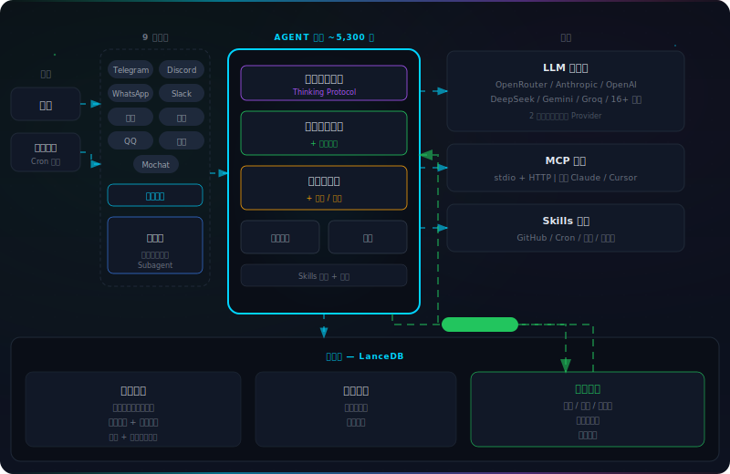
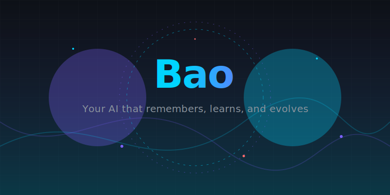
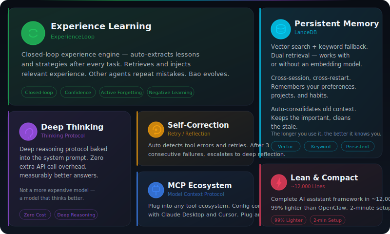
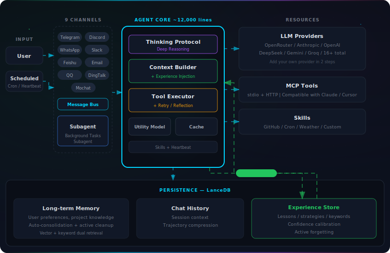

<div align="center">

<br>

<picture>
  <source media="(prefers-color-scheme: dark)" srcset="assets/hero.svg" />
  <source media="(prefers-color-scheme: light)" srcset="assets/hero.svg" />
  
</picture>

<br>

**记得住 · 学得会 · 能进化** · 持久记忆 · 经验引擎 · 子代理并行 · 长任务不漂移 · 9 大平台 · MCP 生态

[🇨🇳 中文](#为什么选-Bao) · [🇺🇸 English](#-english)

</div>

<br>

## 为什么选 Bao？

大多数 AI 助手都有失忆症。每次对话从零开始，反复犯同样的错，记不住你的偏好，永远学不会。

Bao 不一样。它**记得住**、**学得会**、**能进化**。

<p align="center"></p>

### 记忆不会消失

基于 **LanceDB** 的持久化记忆 — 向量搜索 + 关键词降级，双检索架构。有没有 Embedding 模型都能用。

向量表与主记忆表按 `key` 强一致同步，启动时自动校验维度并在不匹配时重建回填；Embedding 调用内置轻量超时与重试，长期运行更稳。

你的偏好、你的项目、你的习惯，Bao 全部记住。旧上下文自动整合，重要信息跨会话、跨重启永久留存，过时内容主动清理。

### 经验持续积累

内置**闭环经验引擎**：

- 每次任务完成 → 自动提取教训、策略和失败模式
- 遇到类似问题 → 检索相关经验，注入到提示词中
- **置信度校准** — Laplace 平滑追踪成功率，避免冷启动偏差，动态调整质量分
- **冲突检测** — 发现矛盾的教训时自动标记
- **负面学习** — 过去的失败变成未来的警告
- **主动遗忘** — 按质量分级衰减（高质量保留更久），高价值经验免疫清理

别的 Agent 重复犯错。**Bao 从错误中进化。**

### 出错能改，工具不乱

- **Retry with Reflection** — 工具报错自动重试。连续 3 次失败后，不是盲目重来，而是反思策略、换条路走
- **Dynamic Tool Hints** — 工具提示跟着实际能力走。装了什么用什么，没装的绝不提。编程代理、搜索、MCP 工具全部按需注入，杜绝幻觉调用

### 复杂任务不阻塞

把耗时任务交给子代理：你继续聊，它在后台把活做完。需要时问一次进度，它就能讲清楚。

- **后台执行** — 子代理独立运行，主代理随时响应你的新消息
- **进度可查** — 主代理调用 `check_tasks` 即可查看子代理当前阶段、已用工具数、迭代轮次；调用 `check_tasks_json` 可获取 schema_version=1 的结构化 JSON（含 `last_error` 错误摘要），适合 UI/自动化消费
- **里程碑推送** — 子代理每 5 轮自动汇报一次进展，不刷屏，关键节点不遗漏
- **续接上次结果** — 可在前序任务结论基础上继续推进，不用从头讲背景
- **长任务引擎** — 轨迹压缩 + 充分性检查 + 上下文压实，复杂任务更稳、更专注
- **随时取消** — 任务跑偏了？`cancel_task` 一键止损；超过 2 分钟无更新会标记警告
- **更高自由度** — 子代理对内部目录不做额外硬拦截；需要收敛权限时可配合 `restrictToWorkspace` 与系统文件权限

一个助手，同时处理多件事。**你问进度，它答得上来。**

### ⌨️ 原生编程代理集成

Bao 自动检测本机安装的编程 CLI（OpenCode、Codex、Claude Code），**有什么用什么，没装不注入**。主代理和子代理同步生效。

- **一句话委托** — 把编程任务交给专业代理，支持会话续接、重试与超时保护（默认 30 分钟，按需覆盖）
- **结果分级** — 默认返回精简摘要省 token；需要排错时按 ID 拉取完整输出
- **内置 Skill** — 每个代理配套标准化工作流（需求澄清 → 实现 → 验证），降低误操作
- **子代理同步** — 后台子代理也能调用编程工具，复杂项目多线程推进

### 🎨 AI 图像生成

一句话描述，Bao 帮你画出来。基于 Gemini 图像生成 API，文字变图片，生成后直接发送到聊天。

- **文字即画笔** — `generate_image(prompt="...")` 一个工具搞定，支持自定义宽高比
- **即生即发** — 生成的图片自动保存为本地文件，通过 `message(media=[path])` 直接发送到任意聊天平台
- **内置 Skill** — 自动识别"画一张""生成图片"等意图，无需手动调用工具
- **配置即启用** — 填入 API Key 即可使用，不填则完全不注入工具，零噪音

### 🖥️ 桌面自动化

让 AI 看见你的屏幕，操作你的电脑。不依赖 Anthropic Computer Use，任何视觉模型都能用。

- **7 个原子工具** — 截屏、点击、输入文字、按键、滚动、拖拽、获取屏幕信息，覆盖日常桌面操作
- **模型无关** — 不绑定任何特定 Provider，OpenAI、Gemini、Anthropic、DeepSeek 等任何支持视觉的模型都能驱动
- **Retina/HiDPI 自适应** — 截图空间与操作空间自动坐标映射，高分屏点哪到哪
- **依赖已内置** — `mss` + `pyautogui` + `Pillow` 随 Bao 默认安装，无需额外操作
- **默认开启** — `config.tools.desktop.enabled: true`，安装即可用；如需关闭可手动设为 `false`

### 🧩 可扩展技能系统

17 个内置技能（编程代理、图像生成、PDF、浏览器自动化、天气、定时任务等），开箱即用。想加自己的？放到 `~/.bao/workspace/skills/` 即可，运行时自动加载。

- **零配置** — 内置技能随 Bao 安装自动可用，无需额外设置
- **用户技能** — 在 workspace 中添加自定义技能，格式与内置技能一致
- **动态注入** — 技能描述自动压缩为单行摘要注入 system prompt，不浪费 token

### 🗜️ Token 极致压缩

同样的能力，更少的 token 开销。Bao 在提示词层面做了系统性压缩：

- **工具描述精简（MVD）** — 每个内置工具的 description 压缩为 1 句话，详细用法放 system prompt 的 tool_hints 区域
- **编程代理合并** — 6 个编程工具合并为 2 个（`coding_agent` + `coding_agent_details`），减少工具列表膨胀
- **MCP Schema 瘦身** — `mcpSlimSchema` 剥离冗余元数据，`mcpMaxTools` 限制注册总量，并支持按 server 覆盖
- **技能摘要压缩** — 技能描述取首句或 60 字符截断，换行归一化为单行格式

### 精悍轻量

**~14,000 行核心代码。** 运行 `bash scripts/core_agent_lines.sh` 自行验证。

启动快、占资源少、源码可读。一个完整的 AI 助手框架，体积只有同类项目的 1%。

### 上下文不会爆炸

内置分层上下文管理，长任务不再耗尽 context window：

- **Layer 1**：tool 输出超过阈值自动外置到本地文件，messages 中只保留预览+指针
- **Layer 2**：context 过大时自动压实，保留最近对话轮次 + 最近工具块，并维持时间线顺序
  默认 `auto` 模式，大输出自动外置、长对话自动压实。设为 `"off"` 可关闭。

### 长任务引擎

把复杂任务交给 Bao，不靠“多跑几步”碰运气，而是靠稳定的长程执行能力：

- **越跑越稳** — 每 5 步自动压缩轨迹，保留结论、证据和未探索分支，方向不丢
- **够了就收** — 充分性检查命中后优先收口，避免无效工具调用；若最终回答为空，会自动回退一次补齐结果
- **错了就改** — 连续失败时自动注入审计纠偏，失败路径去重，减少重复试错
- **预算可控** — 上下文分层压实与状态刷新协同工作，长任务更省 token

### 自动规划

复杂任务不靠蛮力。Bao 会自己拆解步骤、跟踪进度、逐步推进 — 你什么都不用说。

- **AI 自驱** — 遇到多步骤任务，自动创建计划并逐步更新，无需用户指令
- **始终可见** — 每次 `create_plan` / `update_plan_step` / `clear_plan` 都会向当前会话主动推送计划状态
- **渠道自适应** — 支持 Markdown 的渠道发送 Markdown 模板，不支持的渠道自动回退纯文本
- **渲染安全** — Markdown 渠道自动转义特殊符号，避免路径/命令/变量名触发错乱渲染
- **语言自适应** — 计划通知按会话语言偏好（中/英）输出，不同会话可独立
- **线程对齐** — Slack thread 会话会保留 thread 上下文，计划通知持续回到原线程
- **用完即走** — 计划完成后自动归档，不再占用 prompt 预算，干净利落
- **工具可控** — 内置 `create_plan` / `update_plan_step` / `clear_plan` 三个原子工具，计划状态持久化在 session metadata，并以 `## Current Plan` 注入上下文

不用提醒它"你到哪一步了"。**它比你更清楚。**

## 横向对比

| 维度 | OpenClaw | Bao | Bao 优势 |
|:---|:---|:---|:---|
| 语言 | TypeScript | **Python 3.11+** | Python 生态成熟，AI/自动化集成更直接 |
| 核心代码量 | 430,000+ 行 | **~14,000 行核心代码** | 更轻量，维护和迭代成本更低 |
| 记忆系统 | Markdown 文件记忆（手动维护） | **LanceDB 向量检索 + BM25 降级，四分类长期记忆，自动整合去重** | 从手工记录升级为可检索、可治理的长期记忆系统 |
| 经验学习 | 无闭环经验引擎 | **闭环经验引擎（Laplace 平滑、冲突检测、负面学习、主动遗忘）** | 具备可持续自我优化能力 |
| 自我反思 | 无内置反思重试 | **Retry with Reflection（失败后反思并重试）** | 失败可恢复，任务完成率更稳 |
| 后台任务 | 单线程阻塞式 | **子代理独立运行 + 进度追踪 + 里程碑推送 + 可取消** | 前台不被长任务阻塞，协作与可观测性更好 |
| 长任务引擎 | 主要依赖 compaction | **轨迹压缩 + 充分性检查 + 自我纠错** | 长链路任务更可控，降低中途漂移风险 |
| 图像生成 | 无内置 | **Gemini API 文生图 + 多平台发送** | 原生支持图像生成与分发闭环 |
| 桌面自动化 | 无内置 | **7 个桌面自动化工具，模型无关，HiDPI 自适应** | 可直接操作桌面环境，自动化覆盖面更广 |
| 技能系统 | ClawHub 技能生态 | **17 内置 + 用户自定义技能，动态加载** | 开箱即用且可扩展，定制路径更短 |
| Token 压缩 | 无系统性压缩机制 | **MVD 精简 + Schema 瘦身 + 工具合并** | 在能力不减前提下降低上下文开销 |
| 自动规划 | 无内置自动规划 | **3 原子规划工具（create/update/clear），AI 自驱执行** | 从"被动调用"升级为"可执行计划流" |
| 上手时间 | 配置流程相对较重 | **2 分钟一键安装** | 部署门槛更低，试用到落地更快 |

<p align="center"></p>

## 🚀 快速开始

三种方式，任选一种。目标只有一个：**尽快把 `bao` 跑起来**。

### 方式 1：一键安装（推荐）

无需手动装 Python/uv，脚本会自动检查并补齐依赖，然后安装 Bao。

```bash
# macOS
curl -fsSL https://raw.githubusercontent.com/Suge8/Bao/main/install/install.sh | bash

# Windows PowerShell
powershell -ExecutionPolicy Bypass -NoProfile -Command "irm https://raw.githubusercontent.com/Suge8/Bao/main/install/install.ps1 | iex"
```

#### 安装后管理（更新 / 卸载 / 安装位置）

安装完成后，记住这三件事就够了：**在哪、怎么更新、怎么卸载**。

- 📍 Bao 安装在哪里？
  - 可执行命令：`~/.local/bin/bao`（Windows: `%USERPROFILE%\.local\bin\bao.exe`）
  - 工具环境目录：`uv tool dir`
- ⬆️ 想要最新功能？30 秒更新
  - `uv tool upgrade bao-ai`
  - 更新后可用 `bao --version` 快速确认
- 🧹 暂时不用了？一条命令干净卸载
  - `uv tool uninstall bao-ai`
  - 如需连 `uv` 一起移除（可选）：`uv self uninstall`

### 方式 2：已有前置依赖，直接 PyPI 安装

如果你已经有 Python 3.11+，这一条命令就够了。

```bash
python -m pip install -U bao-ai
bao
```

### 方式 3：源码安装（开发者）

适合要调试、改代码或参与贡献的同学。

```bash
git clone https://github.com/Suge8/Bao.git
cd Bao
uv sync
uv run bao
```

#### 源码模式维护（更新 / 移除）

- ⬆️ 保持项目最新：`git pull && uv sync`
- 🧹 不再使用时：删除本地仓库目录即可

首次运行自动生成配置文件（含 `config_version`，后续迁移可稳定收敛）。在 `~/.bao/config.jsonc` 中设置你的 API Key：

```json
{
  "providers": {
    "openaiCompatible": {
      "apiKey": "sk-or-v1-xxx"
    }
  }
}
```

再次运行：

```bash
bao
```

**就这样。真正的一键可用，2 分钟就能开始。**

可选：配置一个**效用模型**用于后台任务（经验提取、记忆整合、会话标题生成），节省开销：

```json
{
  "agents": {
    "defaults": {
      "model": "anthropic/claude-sonnet-4-20250514",
      "utilityModel": "openrouter/google/gemini-flash-1.5"
    }
  }
}
```

## 📝 Changelog

`v0.3.0` 为当前发布版本，详见 [`CHANGELOG.md`](CHANGELOG.md)。

## 💬 9 大聊天平台

一份配置，一条命令：`bao`

| 平台         | 配置方式                           |
| ------------ | ---------------------------------- |
| **Telegram** | @BotFather 获取 Token              |
| **Discord**  | Bot Token + Message Content Intent |
| **WhatsApp** | 扫码连接                           |
| **飞书**     | App ID + App Secret                |
| **Slack**    | Bot Token + App-Level Token        |
| **Email**    | IMAP/SMTP 凭据                     |
| **QQ**       | App ID + App Secret                |
| **钉钉**     | App Key + App Secret               |
| **iMessage** | 仅 macOS，零配置                   |

每个平台渲染能力不同，Bao 心里有数。Telegram 和 Discord 收到格式丰富的 Markdown；Slack 和飞书走各自的标记子集；iMessage、QQ、Email 则是干净的纯文本 — 没有满屏的 `**` 和 `###`。**同一个 AI，9 种最佳阅读体验。**

## 🤖 LLM Provider

极简 4 类覆盖 99% 需求。

| 类型            | 支持的模型                                                                                                       | 示例                                      |
| --------------- | ---------------------------------------------------------------------------------------------------------------- | ----------------------------------------- |
| **OpenAI 兼容** | OpenAI、OpenRouter、DeepSeek、Groq、SiliconFlow、火山引擎、DashScope、Moonshot、智谱、Ollama、LM Studio、vLLM 等 | `openai/gpt-4o`、`deepseek/deepseek-chat` |
| **Anthropic**   | Claude 全系列                                                                                                    | `anthropic/claude-sonnet-4-20250514`      |
| **Gemini**      | Gemini 全系列                                                                                                    | `gemini/gemini-2.0-flash-exp`             |
| **Codex OAuth** | 通过 ChatGPT 订阅 OAuth 认证，无需 API Key                                                                      | `openai-codex/gpt-5.1-codex`             |

Provider 名称可自定义（如 `my-proxy/claude-sonnet-4-6`），前缀自动剥离。所有 Provider 类型均支持第三方代理，SDK 兼容性自动处理。OpenAI 兼容端点默认自动探测并切换 Responses / Chat Completions（无需配置 `apiMode`）。

## 🔌 MCP 支持

Model Context Protocol — 接入任何工具生态。配置兼容 **Claude Desktop 和 Cursor**：

```json
{
  "tools": {
    "toolExposure": {
      "mode": "off",
      "bundles": ["core", "web", "desktop", "code"]
    },
    "mcpMaxTools": 50,
    "mcpSlimSchema": true,
    "mcpServers": {
      "filesystem": {
        "command": "npx",
        "args": ["-y", "@modelcontextprotocol/server-filesystem", "/path"],
        "slimSchema": false,
        "maxTools": 16
      }
    }
  }
}
```

`toolExposure.mode` 支持 `off`（全量工具）和 `auto`（按关键词启用 bundle）；`toolExposure.bundles` 支持 `core/web/desktop/code` 开关。
`mcpMaxTools` 用于限制 MCP 工具总注册数（`0` 表示不限制）；`mcpSlimSchema` 用于精简 MCP schema 的冗余元数据，减少 token 占用。`mcpServers.<name>.slimSchema/maxTools` 可按 server 覆盖全局策略。

默认会记录每轮 tools schema 的体积与质量代理指标到 debug 日志和 session metadata（含 post-error 调用代理，不注入 LLM 上下文，不额外消耗 prompt token）；软中断工具调用会单独计入 `interrupted_tool_calls`，并从 `tool_calls_ok` / `tool_calls_error` 中排除，避免质量指标失真。

## 🐳 Docker

```bash
# 1) 先准备配置（必需）
vim ~/.bao/config.jsonc

# 2) 复制 Docker 专用环境变量模板（仅用于 docker compose）
cp .env.docker.example .env.docker

# 3) 启动网关（默认最小面，非 root 运行）
docker compose --env-file .env.docker up -d bao-gateway

# 4) 若启用 WhatsApp，再启动 bridge profile
docker compose --env-file .env.docker --profile whatsapp up -d bao-whatsapp-bridge

# 5) 查看健康状态与日志
docker compose ps
docker compose logs -f --tail=100 bao-gateway
```

说明：
- `.env.docker` / `.env.docker.example` 仅用于 Docker Compose，不用于本地非 Docker 运行。
- 默认不对外暴露 HTTP 端口；如你有自定义监听场景，可自行在 `docker-compose.yml` 添加 `ports`。
- `deploy.resources` 主要在 Docker Swarm 生效；普通 `docker compose` 可能忽略该段。
- 若启用 WhatsApp，建议配置：`BAO_CHANNELS__WHATSAPP__BRIDGE_URL=ws://bao-whatsapp-bridge:3001`。

## 💬 聊天命令

全平台通用：

| 命令       | 说明                                       |
| ---------- | ------------------------------------------ |
| `/new`     | 新建对话（旧对话自动保留）                 |
| `/stop`    | 停止当前任务（同会话硬中断，抑制过期响应） |
| `/session` | 列出所有对话，按编号选择（含自动标题与相对时间） |
| `/delete`  | 删除当前对话                               |
| `/model`   | 切换模型                                   |
| `/memory`  | 管理记忆（查看、编辑、删除）               |
| `/help`    | 显示可用命令                               |

`/new` 触发旧会话整合时带有去重签名（消息总数 + 尾消息时间戳），同一快照不会重复归档，避免 history 摘要噪音。

会话标题会在首个或第二个用户轮次后异步生成：过滤问候语后，基于首个非问候用户消息及其后续助手回复生成；失败时回退为用户文本截断。
同会话新消息默认走协作式软中断（流式阶段 + 工具边界，优先处理新消息）；`/stop` 保留为硬中断。

## 🖥️ CLI

| 命令  | 说明                                   |
| ----- | -------------------------------------- |
| `bao` | 启动所有平台通道（首次运行自动初始化） |

## ✅ 测试

```bash
uv run pytest tests/ -v
```


## 🖥️ Desktop App (实验性)

基于 PySide6 + QML 的桌面客户端，Bao 的 `bao` CLI 纯 UI 壳子。核心逻辑（AgentLoop、Channels、Cron、Heartbeat）全部复用 `bao/` core，不重复实现。

```bash
uv sync --extra desktop
uv run python app/main.py
```

首次启动自动创建 `~/.bao/config.jsonc` 与 workspace；未配置 Provider/Model 时自动跳转 Settings。详见 [`app/README.md`](app/README.md)。打包说明见 [`docs/desktop-packaging.md`](docs/desktop-packaging.md)。

## 🔒 安全

Bao 内置工作区沙箱、渠道白名单、危险命令拦截、SecretStr 凭据保护等多层安全机制。

完整安全配置与部署检查清单见 [`SECURITY.md`](SECURITY.md)。
## 📁 项目结构

```
bao/
├── agent/          # 核心 Agent 逻辑
│   ├── loop.py     # Agent 循环（重试 + 纠错 + 经验）
│   ├── context.py  # 提示词组装 + 经验注入
│   ├── memory.py   # LanceDB 持久记忆
│   ├── subagent.py # 后台任务执行
│   └── tools/      # 内置工具（Shell、文件、Web、图像生成、桌面自动化、编程代理、MCP）
├── skills/         # 可扩展技能系统
├── channels/       # 9 大平台集成
├── providers/      # 4 种 LLM Provider
├── session/        # 多会话管理（LanceDB 持久化）
├── bus/            # 异步消息路由
├── cron/           # 定时任务
└── cli/            # 命令行界面
```

<br>

<details>
<summary><h2>🇺🇸 English</h2></summary>

<div align="center">

<picture>
  <source media="(prefers-color-scheme: dark)" srcset="assets/hero-en.svg" />
  <source media="(prefers-color-scheme: light)" srcset="assets/hero-en.svg" />
  
</picture>

<br>

**Remembers · Learns · Evolves** · Persistent memory · Experience engine · Sub-agents · Long-task control · 9 platforms · MCP tools

</div>

<br>

### Why Bao?

Most AI assistants have amnesia. Every conversation starts from zero. They repeat the same mistakes, forget your preferences, and never improve.

Bao is different. It **remembers**, **reflects**, and **evolves**.

<p align="center"></p>

#### Memory That Stays

Persistent memory powered by **LanceDB** — vector search with keyword fallback. Dual retrieval that works with or without an embedding model.

Your preferences, your projects, your patterns — Bao remembers all of it. Old context consolidates automatically. Important details survive across sessions, across restarts, indefinitely. Stale content is actively cleaned up.

#### Experience That Compounds

Bao ships with a **closed-loop experience engine**:

- After every task → auto-extracts lessons, strategies, and failure patterns
- Before similar tasks → retrieves relevant experience and injects it into the prompt
- **Confidence calibration** — Laplace-smoothed success tracking, no cold-start bias, dynamic quality adjustment
- **Conflict detection** — flags contradictory lessons
- **Negative learning** — past failures become warnings
- **Active forgetting** — quality-based retention decay (high-quality lasts longer), high-value experiences immune from cleanup

Other agents repeat mistakes. **Bao learns from them.**

#### Self-Correcting, Never Hallucinating

- **Retry with Reflection** — auto-retries on tool errors. After 3 consecutive failures, it doesn't just retry blindly — it rethinks the strategy and tries a different approach
- **Dynamic Tool Hints** — tool suggestions follow actual capabilities. Only installed tools get surfaced. Coding agents, search, MCP tools — all injected on demand. Zero hallucinated tool calls

#### Complex Tasks, Zero Blocking

Hand off time-consuming work to a subagent: keep chatting while it works in the background. Ask once, get a clear status update.

- **Background execution** — subagents run independently while the main agent stays responsive to you
- **Progress on demand** — the main agent calls `check_tasks` to see current phase, tool count, and iteration progress; `check_tasks_json` returns a stable schema_version=1 JSON snapshot (including `last_error` summary) for UI or automation consumers
- **Milestone updates** — subagents auto-report every 5 iterations. No spam, no missed beats
- **Resume from prior results** — continue from a previous task without re-explaining context
- **Long-task engine parity** — trajectory compression + sufficiency checks + context compaction for steadier, more focused long runs
- **Cancel anytime** — task going sideways? `cancel_task` stops it; stalls (2+ minutes) get flagged
- **More freedom** — no extra hard block on internal dirs in subagent flow; use `restrictToWorkspace` and OS permissions when you need tighter control
  One assistant, multiple jobs in flight. **Ask about progress — it always has an answer.**

#### ⌨️ Built-in Coding Agent Integration

Bao auto-detects installed coding CLIs (OpenCode, Codex, Claude Code) — **use what's there, skip what's not**. Works for both the main agent and subagents.

- **One-line delegation** — hand off coding tasks to specialized agents with session continuity, retries, and timeout safety (30-minute default timeout, override only when needed)
- **Tiered output** — compact summaries by default to save tokens; pull full stdout/stderr by ID when debugging
- **Built-in Skills** — each agent comes with a standardized workflow (clarify → implement → verify) for reliable execution
- **Subagent parity** — background subagents can also invoke coding tools for parallel multi-track development

#### 🎨 AI Image Generation

Describe it, Bao draws it. Powered by Gemini's image generation API — text in, image out, delivered straight to your chat.

- **Text-to-image** — `generate_image(prompt="...")` with optional aspect ratio control
- **Generate and send** — images save locally, then ship to any chat platform via `message(media=[path])`
- **Built-in Skill** — auto-triggers on "draw me", "generate an image" — no manual tool calls needed
- **Config-gated** — add your API Key to enable; leave it blank and the tool stays invisible

#### 🖥️ Desktop Automation

Let AI see your screen and operate your computer. No Anthropic Computer Use required — works with any vision-capable model.

- **7 atomic tools** — screenshot, click, type text, key press, scroll, drag, get screen info. Covers everyday desktop operations
- **Model-agnostic** — not locked to any provider. OpenAI, Gemini, Anthropic, DeepSeek — any model with vision can drive it
- **Retina/HiDPI aware** — automatic coordinate mapping between screenshot space and input space. Pixel-perfect on high-DPI displays
- **Deps included** — `mss` + `pyautogui` + `Pillow` ship with the default Bao install, no extra steps needed
- **On by default** — `config.tools.desktop.enabled: true`; set to `false` to disable
#### 🧩 Extensible Skill System

17 built-in skills (coding agents, image generation, PDF, browser automation, weather, cron, and more) ready out of the box. Want your own? Drop it into `~/.bao/workspace/skills/` — Bao picks it up at runtime.

- **Zero config** — built-in skills are available the moment Bao is installed
- **User skills** — add custom skills to your workspace in the same format as built-ins
- **Dynamic injection** — skill descriptions are auto-compressed into one-line summaries for the system prompt, saving tokens

#### 🗜️ Aggressive Token Compression

Same capabilities, fewer tokens. Bao applies systematic compression at the prompt level:

- **Minimum Viable Descriptions (MVD)** — every built-in tool description is compressed to a single sentence; detailed usage goes into system prompt tool_hints
- **Coding agent consolidation** — 6 coding tools merged into 2 (`coding_agent` + `coding_agent_details`), cutting tool-list bloat
- **MCP Schema slimming** — `mcpSlimSchema` strips redundant metadata, `mcpMaxTools` caps total registrations, and per-server overrides are supported
- **Skill summary compression** — skill descriptions are truncated to the first sentence or 60 characters, normalized to single-line format

#### Lean & Compact

**~14,000 lines of core code.** Run `bash scripts/core_agent_lines.sh` to verify.

Fast startup. Low resource use. Readable source. A complete AI assistant framework at 1% the size of comparable projects.

### Context That Doesn't Explode

Built-in layered context management keeps long tasks from exhausting the context window:

- **Layer 1**: Large tool outputs are offloaded to local files; messages retain only a preview + pointer
- **Layer 2**: When context grows too large, context is compacted to keep recent dialogue turns plus recent tool blocks while preserving timeline order
  Default `auto` mode auto-offloads large outputs and compacts long conversations. Set `"off"` to disable.

### Long-Task Engine

For complex runs, Bao doesn't rely on luck. It uses a compact, production-ready long-task engine:

- **Stays on track** — Every 5 steps, trajectory state is compressed into conclusions, evidence, and unexplored branches
- **Stops when enough** — Sufficiency checks prioritize early finish; if a forced final comes back empty, Bao automatically allows one recovery pass
- **Self-corrects quickly** — Consecutive failures trigger audit-style correction, with deduplicated failed paths to avoid repeated dead ends
- **Token-aware by default** — Layered compaction and refreshed state notes keep long runs focused and cost-efficient

In short: **less drift, fewer wasted calls, stronger final answers.**

### Auto Planning

Complex tasks shouldn't require hand-holding. Bao breaks down the work, tracks each step, and drives to completion — without being told to.

- **Self-directed** — Detects multi-step tasks, creates a plan, and updates progress automatically. No user commands needed
- **Always visible** — Every `create_plan` / `update_plan_step` / `clear_plan` change is proactively pushed to the current chat
- **Channel-adaptive** — Markdown-capable channels receive Markdown templates, while plain-text channels auto-fallback to text
- **Render-safe** — Markdown channels escape special symbols to prevent accidental formatting breaks in paths/commands/variables
- **Language-aware** — Plan notifications follow per-session language preference (zh/en), so sessions can differ independently
- **Thread-consistent** — Slack thread sessions preserve thread context, so plan updates stay in the same thread
- **Clean exit** — Finished plans archive themselves and stop consuming prompt budget. No stale context, no wasted tokens
- **Tool-level control** — Built-in atomic tools `create_plan` / `update_plan_step` / `clear_plan` persist plan state in session metadata and inject `## Current Plan` into context

You'll never have to ask "where were you again?" **It already knows.**

### How It Compares

| Dimension | OpenClaw | Bao | Edge |
|:---|:---|:---|:---|
| Language | TypeScript | **Python 3.11+** | Strong Python AI ecosystem makes automation integrations faster |
| Core code size | 430,000+ LOC | **~14,000 LOC (core)** | Leaner codebase is easier to maintain and evolve |
| Memory system | Markdown file memory (manual upkeep) | **LanceDB vector retrieval + BM25 fallback, 4-category long-term memory, auto merge/dedup** | Upgrades memory from manual notes to searchable managed knowledge |
| Experience learning | No closed-loop experience engine | **Closed-loop engine (Laplace smoothing, conflict checks, negative learning, active forgetting)** | Delivers continuous self-improvement over time |
| Self-reflection | No built-in reflection retry | **Retry with Reflection after failures** | Better recovery path and more stable completion rate |
| Background tasks | Single-thread blocking flow | **Independent subagents + progress tracking + milestones + cancellation** | Long tasks no longer block foreground interactions |
| Long-task engine | Mostly compaction-based | **Trajectory compression + sufficiency checks + self-correction** | More controlled execution on long, multi-step workflows |
| Image generation | No built-in | **Gemini text-to-image + cross-platform delivery** | Native generation-to-delivery pipeline |
| Desktop automation | No built-in | **7 desktop automation tools, model-agnostic, HiDPI-aware** | Broader automation reach into real desktop operations |
| Skill system | ClawHub skill ecosystem | **17 built-in + user-defined skills, dynamically loaded** | Faster out-of-box value with flexible extension path |
| Token compression | No systematic compression stack | **MVD slimming + schema reduction + tool consolidation** | Reduces context overhead while preserving capability |
| Auto planning | No built-in auto-planning | **3 atomic planning tools (create/update/clear), AI-driven flow** | Enables executable planning instead of ad-hoc sequencing |
| Time to start | Setup and onboarding are comparatively heavier | **2-minute one-click install** | Lower activation friction from trial to production |

<p align="center"></p>

### 🚀 Quick Start

Three paths, same result: **get `bao` running fast**.

#### Method 1: One-click install (Recommended)

No manual Python/uv setup. The script checks and installs everything for you.

```bash
# macOS
curl -fsSL https://raw.githubusercontent.com/Suge8/Bao/main/install/install.sh | bash

# Windows PowerShell
powershell -ExecutionPolicy Bypass -NoProfile -Command "irm https://raw.githubusercontent.com/Suge8/Bao/main/install/install.ps1 | iex"
```

#### Post-install Management (Update / Uninstall / Location)

After install, remember just three things: **where it lives, how to update, and how to remove it**.

- 📍 Where is Bao installed?
  - Executable: `~/.local/bin/bao` (Windows: `%USERPROFILE%\.local\bin\bao.exe`)
  - Tool environment directory: `uv tool dir`
- ⬆️ Want the latest features? Update in ~30 seconds
  - `uv tool upgrade bao-ai`
  - Verify after update with `bao --version`
- 🧹 Need to remove it? One clean uninstall command
  - `uv tool uninstall bao-ai`
  - Remove `uv` itself too (optional): `uv self uninstall`

#### Method 2: PyPI install (if prerequisites are ready)

If Python 3.11+ is already installed, this is the fastest route.

```bash
python -m pip install -U bao-ai
bao
```

#### Method 3: Install from source (for developers)

Best for local development, debugging, or contribution workflows.

```bash
git clone https://github.com/Suge8/Bao.git
cd Bao
uv sync
uv run bao
```

#### Source-mode Maintenance (Update / Remove)

- ⬆️ Stay current: `git pull && uv sync`
- 🧹 Done with it: remove the local repository directory

First run auto-generates a config file (with `config_version` for stable migration behavior). Set your API key in `~/.bao/config.jsonc`:

```json
{
  "providers": {
    "openaiCompatible": {
      "apiKey": "sk-or-v1-xxx"
    }
  }
}
```

Run again:

```bash
bao
```

**That is it. A true one-click path and a full setup in minutes.**

Optional: configure a **Utility Model** for background tasks (experience extraction, memory consolidation, session title generation) to save costs:

```json
{
  "agents": {
    "defaults": {
      "model": "anthropic/claude-sonnet-4-20250514",
      "utilityModel": "openrouter/google/gemini-flash-1.5"
    }
  }
}
```

### 📝 Changelog

`v0.3.0` is the current release; see [`CHANGELOG.md`](CHANGELOG.md).

### 💬 9 Chat Platforms

One config, one command: `bao`

| Platform     | Setup                              |
| ------------ | ---------------------------------- |
| **Telegram** | Token from @BotFather              |
| **Discord**  | Bot Token + Message Content Intent |
| **WhatsApp** | Scan QR code                       |
| **Feishu**   | App ID + App Secret                |
| **Slack**    | Bot Token + App-Level Token        |
| **Email**    | IMAP/SMTP credentials              |
| **QQ**       | App ID + App Secret                |
| **DingTalk** | App Key + App Secret               |
| **iMessage** | macOS only, zero config            |

Every platform renders differently — Bao knows that. Telegram and Discord get rich Markdown. Slack and Feishu get their native markup. iMessage, QQ, and Email get clean plain text — no raw `**` or `###` cluttering the screen. **One AI, nine tailored reading experiences.**

### 🤖 Easy LLM Providers config

Covers 99% of what's out there, plus an OAuth option.

| Type                  | Supported Models                                                                                                           | Example                                   |
| --------------------- | -------------------------------------------------------------------------------------------------------------------------- | ----------------------------------------- |
| **OpenAI Compatible** | OpenAI, OpenRouter, DeepSeek, Groq, SiliconFlow, Volcengine, DashScope, Moonshot, Zhipu, Ollama, LM Studio, vLLM, and more | `openai/gpt-4o`, `deepseek/deepseek-chat` |
| **Anthropic**         | Full Claude lineup                                                                                                         | `anthropic/claude-sonnet-4-20250514`      |
| **Gemini**            | Full Gemini lineup                                                                                                         | `gemini/gemini-2.0-flash-exp`             |
| **Codex OAuth**       | Auth via ChatGPT subscription, no API Key needed                                                                           | `openai-codex/gpt-5.1-codex`             |

Provider names are customizable — model prefixes are auto-stripped. All provider types support third-party proxies with automatic SDK compatibility. OpenAI-compatible endpoints automatically detect and switch between Responses and Chat Completions (no `apiMode` config needed).

### 🔌 MCP Support

Model Context Protocol — plug into any tool ecosystem. Config format is **compatible with Claude Desktop and Cursor**:

```json
{
  "tools": {
    "toolExposure": {
      "mode": "off",
      "bundles": ["core", "web", "desktop", "code"]
    },
    "mcpMaxTools": 50,
    "mcpSlimSchema": true,
    "mcpServers": {
      "filesystem": {
        "command": "npx",
        "args": ["-y", "@modelcontextprotocol/server-filesystem", "/path"],
        "slimSchema": false,
        "maxTools": 16
      }
    }
  }
}
```

`toolExposure.mode` supports `off` (all tools) and `auto` (keyword-based bundle activation). `toolExposure.bundles` supports `core/web/desktop/code` switches.
`mcpMaxTools` caps the total number of MCP tools registered (`0` = unlimited). `mcpSlimSchema` strips redundant schema metadata to reduce token usage. `mcpServers.<name>.slimSchema/maxTools` can override global behavior per server.

By default, per-turn tool schema size and quality proxy metrics are recorded in debug logs and session metadata (including a post-error-call proxy; not injected into LLM context, so no prompt token overhead). Soft-interrupted tool calls are tracked in `interrupted_tool_calls` and excluded from both `tool_calls_ok` and `tool_calls_error` so quality metrics are not skewed.

### 🐳 Docker

```bash
# 1) Prepare config first (required)
vim ~/.bao/config.jsonc

# 2) Copy Docker-only env template (for docker compose only)
cp .env.docker.example .env.docker

# 3) Start gateway (least-privilege runtime)
docker compose --env-file .env.docker up -d bao-gateway

# 4) If WhatsApp is enabled, start bridge profile
docker compose --env-file .env.docker --profile whatsapp up -d bao-whatsapp-bridge

# 5) Check health/status and logs
docker compose ps
docker compose logs -f --tail=100 bao-gateway
```

Notes:
- `.env.docker` / `.env.docker.example` are for Docker Compose only, not for non-Docker local runtime.
- No HTTP ingress port is exposed by default. Add `ports` in `docker-compose.yml` only if you have a custom listener scenario.
- `deploy.resources` is primarily effective in Docker Swarm; regular `docker compose` may ignore it.
- For WhatsApp profile, recommended override: `BAO_CHANNELS__WHATSAPP__BRIDGE_URL=ws://bao-whatsapp-bridge:3001`.

### 💬 Chat Commands

Available across all platforms:

| Command    | What it does                                                                               |
| ---------- | ------------------------------------------------------------------------------------------ |
| `/new`     | Start a new conversation (old one is preserved)                                            |
| `/stop`    | Stop the current task (hard interrupt for the current session, stale responses suppressed) |
| `/session` | List all conversations with auto-generated titles and relative timestamps, pick by number   |
| `/delete`  | Delete current conversation                                                                |
| `/model`   | Switch model                                                                               |
| `/memory`  | Manage memories (view, edit, delete)                                                       |
| `/help`    | Show available commands                                                                    |

`/new` now deduplicates archive-all consolidation using a lightweight snapshot signature (message count + tail timestamp), preventing duplicate history summaries for unchanged sessions.

Session titles are generated asynchronously after the first or second user turn: greetings are filtered, then the first non-greeting user message is paired with its following assistant reply; if generation fails, it falls back to truncated user text.
New messages in the same session use cooperative soft interruption by default (stream phase + tool boundary); `/stop` remains a hard interrupt.

### 🖥️ CLI

| Command | What it does                                                |
| ------- | ----------------------------------------------------------- |
| `bao`   | Start all platform channels (auto-initializes on first run) |

### ✅ Tests

```bash
uv run pytest tests/ -v
```


### 🖥️ Desktop App (experimental)

PySide6 + QML desktop client — a pure UI shell for Bao's `bao` CLI. All core logic (AgentLoop, Channels, Cron, Heartbeat) reuses `bao/` core, no duplication.

```bash
uv sync --extra desktop
uv run python app/main.py
```

First launch auto-creates `~/.bao/config.jsonc` and workspace; redirects to Settings if Provider/Model is not configured. See [`app/README.md`](app/README.md). Packaging guide: [`docs/desktop-packaging.md`](docs/desktop-packaging.md).

### 🔒 Security
Bao includes workspace sandboxing, channel allowlists, dangerous command interception, SecretStr credential protection, and more.
Full security configuration and deployment checklist: [`SECURITY.md`](SECURITY.md).
### 📁 Project Structure

```
bao/
├── agent/          # Core agent logic
│   ├── loop.py     # Agent loop (retry + self-correction + experience)
│   ├── context.py  # Prompt assembly + experience injection
│   ├── memory.py   # LanceDB persistent memory
│   ├── subagent.py # Background task execution
│   └── tools/      # Built-in tools (shell, files, web, image gen, desktop automation, coding agents, MCP)
├── skills/         # Extensible skill system
├── channels/       # 9 platform integrations
├── providers/      # 4 LLM provider types
├── session/        # Multi-session management (LanceDB persistence)
├── bus/            # Async message routing
├── cron/           # Scheduled tasks
└── cli/            # Command line interface
```

</details>

<br>

<div align="center">

<sub>Bao — 记得住的 AI 助手。</sub>

</div>
